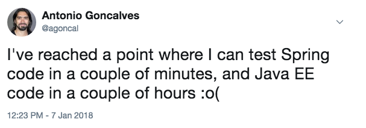

# TDD with Spring Boot

- <i class="fa fa-user"></i>&nbsp;Christoph Welcz
- <i class="fa fa-twitter" aria-hidden="true"></i>&nbsp;[@ChristophWelcz](https://twitter.com/ChristophWelcz)
- <i class="fa fa-github" aria-hidden="true"></i>&nbsp;[github.com/enolive/spring-tdd](https://github.com/enolive/spring-tdd)

<--->

## Spring Boot has 1st class test support

* All features testable
* no need for 3rd party libraries and tools

<--->

## What about JEE?

[](https://twitter.com/agoncal/status/949964624962772992)

[Link to Blog Post](https://antoniogoncalves.org/2018/01/16/java-ee-vs-spring-testing/)

<--->

## How to do it?

* Add maven dependency `spring-boot-starter-test`
* Annotate your tests with `@SpringBootTest`
* Run with `SpringRunner.class` (if you are still on JUnit4)

<-->

```java
@RunWith(SpringRunner.class)
@SpringBootTest
public class MyServiceTests {
    @Autowired
    private MyService service;
    
    @Test
    public void serviceShouldWork() {
        assertThat(service.sayHello()).isEqualTo("Hello, World!");
    }
}
```

<--->

## Spring Boot Test Starter comes with

* JUnit4
* AssertJ
* Mockito
* Test Utilities
* JSONassert
* ...

<--->

## Scope of this talk

* Live Coding
* create a Spring Boot Project from scratch
* Fizz-Buzz
* TDD micro-cycle
* Java with Maven

<--->

## Out of scope

Hipster stuff 😉

<-->

<section tagcloud large>
    Kotlin
    Gradle
    Groovy
    Spock
    VAVR
    WebFlux
    Monads
    Applicatives
    Validation
    Either
    Reactive Web
    JSON
    JPA
    JDBC
    Mongo
    Redis
    Neo4j
    Cloud Connectors
    Spring Boot Profiles
    Configuration
<section>

<--->

## Let's start 👨‍💻...

<--->

## 💗 for joining me!

* <i class="fa fa-book" aria-hidden="true"></i>&nbsp;[Spring Boot Testing](https://docs.spring.io/spring-boot/docs/current/reference/html/boot-features-testing.html)
* <i class="fa fa-youtube" aria-hidden="true"></i>&nbsp;[Screen Cast (done by me)](https://youtu.be/RDRM4lnNMVo)
