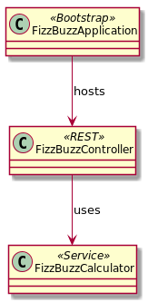

# TDD with Spring Boot

- <i class="fa fa-user"></i>&nbsp;Christoph Welcz
- <i class="fa fa-twitter" aria-hidden="true"></i>&nbsp;[@ChristophWelcz](https://twitter.com/ChristophWelcz)
- <i class="fa fa-github" aria-hidden="true"></i>&nbsp;[github.com/enolive/spring-tdd](https://github.com/enolive/spring-tdd)

<--->

## Spring Boot has 1st class test support

* All features testable
* no need for 3rd party libraries and tools

<-->

## What about JEE?

[](https://twitter.com/agoncal/status/949964624962772992)

[Link to Blog Post](https://antoniogoncalves.org/2018/01/16/java-ee-vs-spring-testing/)

<--->

## How to do it?

* Add maven dependency `spring-boot-starter-test`
* Annotate your tests with `@SpringBootTest`
* Run with `SpringRunner.class` (if you are still on JUnit4)

<-->

```groovy
@SpringBootTest
@ContextConfiguration(classes = MyService)
class MyServiceTests extends Specification {
  @Autowired
  private MyService sut

  def "world is greeted"() {
    when: "we want a greeting"
    def result = sut.sayHello()

    then: "the world is greeted"
    result == "Hello, World!"
  }

  def "specified person #person is greeted with #expected"() {
    when: "we want a specific greeting"
    def result = sut.sayHelloTo(name)

    then: "the greeting meets our demands"
    result == expected

    where:
    name    | expected
    "World" | "Hello, World!"
    "Chris" | "Hello, Chris!"
  }
}
```

## Spring Boot Test Starter comes with

* JUnit4
* AssertJ
* Mockito
* Test Utilities
* JSONassert
* ...

<--->

## Scope of this talk

* Live Coding
* Spring Boot Project from scratch
* Fizz-Buzz
* TDD micro-cycle
* Java with Maven+Lombok for Implementation
* Spock for Testing (cause it's groovy ❤️)

<-->

## Out of scope

Hipster stuff 😉

<-->

<section tagcloud large>
    Kotlin
    Gradle
    VAVR
    Reactive Web
    WebFlux
    Project Reactor
    Monads
    Applicatives
    Validation
    Either
    JSON
    JPA
    JDBC
    Mongo
    Redis
    Neo4j
    Cloud Connectors
    Spring Boot Profiles
    Configuration
    Spring Security
<section>

<-->

## Structure of the App



<--->

## Let's start 👩‍💻...

<--->

## 💗 for joining me!

* <i class="fa fa-book" aria-hidden="true"></i>&nbsp;[Spring Boot Testing](https://docs.spring.io/spring-boot/docs/current/reference/html/boot-features-testing.html)
* <i class="fa fa-youtube" aria-hidden="true"></i>&nbsp;[My Screen Cast on this topic](https://youtu.be/RDRM4lnNMVo)
