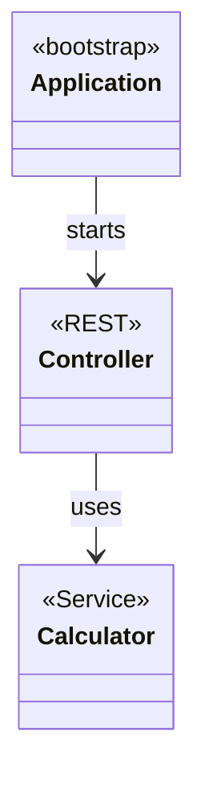

---
# try also 'default' to start simple
theme: datev-scc
highlighter: shiki
lineNumbers: false
download: true
info: |
  ## TDD with Spring Boot
  Short introduction how to do TDD in Spring Boot
drawings:
  persist: false
---

# TDD with Spring Boot

<carbon-link/> [enolive.github.io/spring-tdd](https://enolive.github.io/spring-tdd)

<my-v-card />

---
layout: banner
main: unit tests
sub: 1st class
---

---
class: text-3xl
---

# Definition


<div class="fade">

<v-clicks>

* comes out of the box
* All features testable
* no need for 3rd party libraries and tools

</v-clicks>

</div>

<style>
  h1 {
    @apply text-2xl;
  }
</style>

---
layout: banner
main: what about
sub: jee?
---

---

<tweet id="949964624962772992" />

<carbon-link /> [Link to Blog Post](https://antoniogoncalves.org/2018/01/16/java-ee-vs-spring-testing/)

---
layout: banner
main: quickstart
---

---
layout: two-cols
---

# How to do it?

<div class="fade">

<v-clicks>

1. maven dependency `spring-boot-starter-test`
2. Annotate your tests with `@SpringBootTest`
3. Use `@ContextConfiguration` to limit your testing scope!
4. Test
5. Implement
6. Refactor
7. GOTO 4.

</v-clicks>

</div>

::right::

<div v-click>

```groovy
@SpringBootTest
@ContextConfiguration(classes = MyService)
class MyServiceTests extends Specification {
  @Autowired
  private MyService sut

  def "world is greeted"() {
    when: "we want a greeting"
    def result = sut.sayHello()

    then: "the world is greeted"
    result == "Hello, World!"
  }

  def "specified person #person is greeted with #expected"() {
    when: "we want a specific greeting"
    def result = sut.sayHelloTo(name)

    then: "the greeting meets our demands"
    result == expected

    where:
    name    | expected
    "World" | "Hello, World!"
    "Chris" | "Hello, Chris!"
  }
}
```

<style>
  h1 {
    @apply text-xl;
  }
</style>

</div>

---
layout: banner
main: goodies
---

---
class: text-3xl
---

## Test Starter comes with

<div class="fade">

<v-clicks>

* JUnit4
* AssertJ
* Mockito
* Test Utilities
* JSONassert
* ...

</v-clicks>

</div>

<v-click>

<carbon-arrow-right/> ...including [Spock Framework](https://spockframework.org/) highly recommended!

</v-click>

<style>
  h1 {
    @apply text-2xl;
  }
</style>

---
layout: banner
main: talk
sub: scope
---

---
class: fade
---

<v-clicks>

* Live Coding
* Spring Boot Project from scratch
* Fizz-Buzz
* TDD micro-cycle
* Java with Maven+Lombok for Implementation
* Spock for Testing (cause it's groovy ❤️)

</v-clicks>

---
layout: banner
main: out of scope
sub: hipster stuff
---

---

<word-cloud :list="[
  'Kotlin',
  'Gradle',
  'VAVR',
  'Property Based Testing',
  'Reactive Web',
  'WebFlux',
  'Project Reactor',
  'Monads',
  'Applicatives',
  'Validation',
  'Either',
  'JPA',
  'JDBC',
  'Mongo',
  'Redis',
  'Spring Boot Profiles',
  'Configuration',
  'Spring Security',
]"
/>

---
layout: banner
main: app
sub: structure
---

---



---
layout: image
image: https://source.unsplash.com/random?coding
---

# Let's start 👩‍💻...

<style>
  h1 {
    @apply text-shadow-xl;
  }
</style>

---
layout: cover
---

# 💗 for joining me!

<carbon-link/> [enolive.github.io/spring-tdd](https://enolive.github.io/spring-tdd)

<carbon-link /> [Spring Boot Testing](https://docs.spring.io/spring-boot/docs/current/reference/html/boot-features-testing.html)

<carbon-link /> [Spock Framework](https://spockframework.org/)

<my-v-card />
